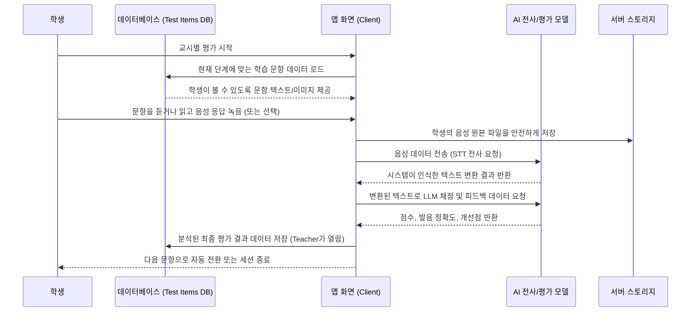
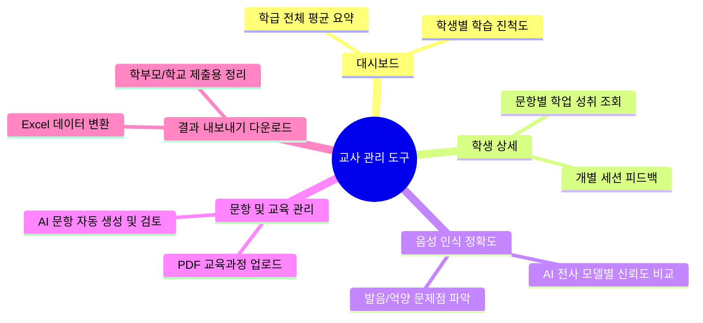

# AI Diagnostic Assessment Platform for Primary English Literacy: AIDAPEL

> **안내**: 본 플랫폼의 구체적인 개발 배경 및 모델 평가 관련 상세 내용은 반드시 **[개발 보고서(논문)](./AI_초등영어_기초학력_진단_플랫폼_개발_보고서.md)**를 참조하시기 바랍니다.  
> 본 문서(리드미)는 누구나 쉽게 플랫폼의 구조를 이해하고 직관적으로 시작할 수 있도록 최대한 핵심만을 간략히 요약하여 전달합니다.

**✅ 바로 접근할 수 있는 주요 문서 및 자료 (클릭하세요)**
- 📄 [AI 초등영어 기초학력 진단 플랫폼 개발 보고서](./AI_초등영어_기초학력_진단_플랫폼_개발_보고서.md) 
- 📘 [플랫폼 사용자 가이드](./AIDTPEL%20사용자%20가이드(2025-12-02).html) 
- 📊 [소개용 PPT 자료](./PPT.html)

---

## 📌 시스템 아키텍처 (모델 구성 컴포넌트)

본 플랫폼의 시스템은 다음의 아키텍처로 구성되어 다양한 모델이 유기적으로 데이터를 주고받습니다.

```mermaid
graph TD
    subgraph Frontend "Frontend (Next.js & React)"
        UI[웹 인터페이스]
        Student[학생 평가 환경]
        Teacher[교사용 대시보드]
    end
    
    subgraph Backend_Data "Backend & Database"
        API[API 라우트]
        DB[(Supabase DB)]
        Storage[(Supabase Storage)]
    end
    
    subgraph AI_Models "AI & STT 컴포넌트"
        OpenAI[OpenAI (채점/전사/TTS)]
        Gemini[Google Gemini API]
        AWS[AWS Transcribe]
        Azure[Azure Speech API]
    end
    
    UI <--> API
    Student --> UI
    Teacher --> UI
    
    API <--> DB : 문항 호출 및 결과 저장
    API <--> Storage : 응답 오디오 저장/로드
    API <--> AI_Models : 음성 전사(STT) 및 채점/피드백 요청
```

---

## 🔄 시스템 작동 워킹 플로우 (Working Flow)

학생이 평가를 진행할 때 문항이 어디서 추출되고, 음성이 전송되어 어떻게 평가 결과로 이어지는지 나타내는 전반적인 흐름입니다.



---

## 🧑‍🏫 교사 관리 기능 시각화

교사 계정의 도구들은 학생의 평가 데이터를 면밀히 관리할 수 있도록 설계되었습니다.



---

## 📁 간소화된 파일 구조 (유기적 작동 환경)

프로젝트 내부의 수많은 경로는 하나의 핵심 디렉토리 구조에서 밀접하게 작동합니다.

- **`src/app/`**: 웹 인터페이스 경로, API 라우팅 등 프로그램 구동의 뼈대
- **`src/components/`**: 버튼, 카드 등 시각적이고 재사용이 가능한 디자인 덩어리들
- **`src/lib/`**: 데이터 연동(Supabase) 및 핵심 AI 판독 연결 로직들
> 모든 파일은 이 **`src/` 경로 안에서 하나의 어플리케이션으로 집중되어 유기적으로 작동**하므로, 유지보수 및 코드 파악이 매우 직관적입니다.

---

## 🤖 AI 모델 선택 및 편집 모드

AIDAPEL은 단일 모델에 종속되지 않습니다. 사용자는 상황과 비용에 맞춰 구동시킬 AI 모델을 쉽게 교체하고 편집할 수 있습니다. 
기능을 변경하고 싶다면, 시스템 환경 변수(`.env.local`)를 통해 원하는 API 키를 켜고 끄는 방식으로 다음과 같은 모델을 자율적으로 선택할 수 있습니다:

- **OpenAI API**: 강력하고 범용적인 텍스트 해석 및 채점에 우선 사용
- **Google Gemini, AWS Transcribe, Azure Speech**: 다양한 음성 인식(STT) 대안으로 손쉽게 코드 선택 편집 가능

---

## 🚀 개발 서버 시작하기

1. **저장소 클론 및 패키지 설치**
   ```bash
   npm install
   ```
2. **환경변수 설정**
   디렉토리에 `.env.local` 파일을 생성하고, Supabase, OpenAI 등의 필수 시스템 API 키를 입력하여 AI 모델 활성화 모드를 설정합니다. (`env.example` 파일 참조)
3. **가동**
   ```bash
   npm run dev
   ```
   이후 `http://localhost:3000` 에 접속하여 AIDAPEL의 기능을 직접 확인할 수 있습니다.

---
---

# 🇬🇧 English Summary

**AI Diagnostic Assessment Platform for Primary English Literacy: AIDAPEL**

> **Note**: For extensive operational details and model evaluations, please refer to the main **[Development Report](./AI_초등영어_기초학력_진단_플랫폼_개발_보고서.md)**. This README is intended as a swift introduction to system operations.

### System Overview
AIDAPEL is designed to evaluate and assist primary learners with their foundational English skills by organically integrating Next.js, Supabase, and multiple AI integrations under simplified source architectures (`src/` directory).

### Core Highlights
1. **Adaptive Architecture**: A unified system that passes student data directly from test items (DB) -> interactions -> audio storage -> diverse AI transcription validations.
2. **Flexible AI Model Adjustments**: Developers can easily toggle between OpenAI, AWS, Gemini, or Azure for the best transcription (STT) tasks by simply managing environmental variables.
3. **Teacher Management Suite**: Visual dashboards allow educators to effortlessly track student performance, compare multi-model AI transcription accuracy, auto-generate test items per curricula, and export result metrics.

### Getting Started
Simply run `npm install`, add your AI/DB tokens to `.env.local`, and run `npm run dev` to launch the platform locally!
